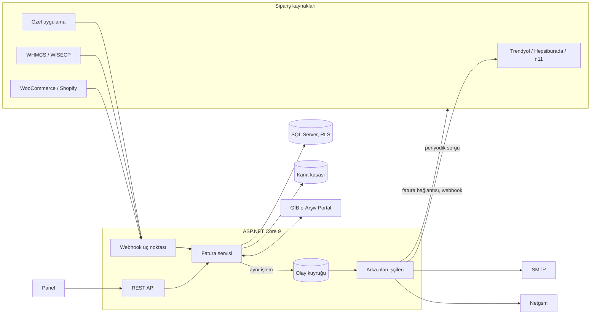
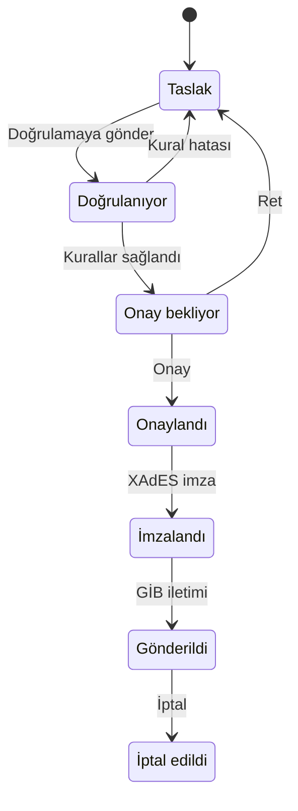

<p align="center">
  <a href="https://www.bilhost.com/">
    <picture>
      <source media="(prefers-color-scheme: dark)" srcset="assets/branding/bilhost-logo-dark.svg">
      
    </picture>
  </a>
</p>

<h2 align="center">Projemiz <a href="https://www.bilhost.com/">Bilhost</a> tarafından desteklenmektedir.</h2>

<p align="center"><a href="https://www.bilhost.com/"><b>www.bilhost.com</b></a></p>

<br>

<div align="center">

# GIB Framework

Gelir İdaresi Başkanlığı e-Fatura ve e-Arşiv süreçleri için çok amaçloı faturalama platformu.


[Canlı demo](https://framework.hamzadenizyilmaz.com.tr) &nbsp;|&nbsp;
[Swagger](https://framework.hamzadenizyilmaz.com.tr/swagger) &nbsp;|&nbsp;
[ReDoc](https://framework.hamzadenizyilmaz.com.tr/redoc) &nbsp;|&nbsp;
[Değişiklik günlüğü](CHANGELOG.md) &nbsp;|&nbsp;
[Güvenlik](SECURITY.md)

</div>

## İçindekiler

1. [Genel bakış](#genel-bakış)
2. [Özellikler](#özellikler)
3. [Mimari](#mimari)
4. [Teknoloji yığını](#teknoloji-yığını)
5. [Kurulum](#kurulum)
6. [Demo hesapları](#demo-hesapları)
7. [Roller ve yetkiler](#roller-ve-yetkiler)
8. [Fatura yaşam döngüsü](#fatura-yaşam-döngüsü)
9. [E-posta ve SMS bildirimleri](#e-posta-ve-sms-bildirimleri)
10. [Pazaryeri ve e-ticaret entegrasyonları](#pazaryeri-ve-e-ticaret-entegrasyonları)
11. [REST API](#rest-api)
12. [Güvenlik](#güvenlik)
13. [Canlı ortama alma](#canlı-ortama-alma)
14. [Veritabanı](#veritabanı)
15. [Proje yapısı](#proje-yapısı)
16. [Lisans ve iletişim](#lisans-ve-iletişim)

## Genel bakış

GIB Framework; fatura hazırlama, kural doğrulama, onay, mali mühürle imzalama, GİB'e iletim ve arşivleme adımlarını tek bir
uygulamada toplar. Her firma kendi verisine SQL Server Row-Level Security ile izole edilmiş olarak erişir. Pazaryerleri,
e-ticaret altyapıları ve hosting faturalama sistemlerinden gelen siparişler otomatik olarak faturaya dönüştürülür; düzenlenen
fatura müşteriye e-posta ve SMS ile, kaynak platforma ise PDF bağlantısı olarak geri bildirilir.

## Özellikler

### Belge yönetimi

| Alan | Kapsam |
|---|---|
| e-Fatura ve e-Arşiv | Alıcının e-Fatura mükellefiyetine göre belge türünün otomatik seçimi; taslak, doğrulama, onay, imza ve gönderim aşamaları |
| UBL-TR | UBL-TR 1.2 belge üretimi, XAdES-BES imza, GİB karekodu |
| Kanıt kasası | İmzalı belgelerin hash zinciriyle bağlanmış, değiştirilemez arşivi ve bütünlük doğrulaması |
| PDF fatura | Firma logosu ve karekod içeren A4 çıktı; çok sayfalı kalem listesi, Türkçe karakter desteği |
| Paylaşım bağlantısı | Müşterinin oturum açmadan faturayı görüntüleyip PDF ve XML indirebildiği, süre sınırlı ve imzalı bağlantı |
| Nihai tüketici | Kimlik numarası bulunmayan alıcılar için `11111111111` ile düzenleme |

### GİB ve mevzuat

| Alan | Kapsam |
|---|---|
| GİB e-Arşiv Portal | Test kullanıcısı, portal taslağı, SMS doğrulaması ile imzalama, portal belgelerinin listelenmesi |
| Kural motoru | Sürümlenen ve yürürlük tarihli KDV, tevkifat ve istisna kuralları; mevzuat kaynağı değişiklik takibi |
| Referans veriler | 81 il, TKGM ilçe ve mahalle verisi, 860 birimlik GİB vergi dairesi listesi |

### İletişim ve entegrasyon

| Alan | Kapsam |
|---|---|
| E-posta | STARTTLS, SSL ve SMTP AUTH destekli yerleşik istemci; firma markalı HTML şablonlar; PDF ve UBL-TR XML ekleri |
| SMS | Netgsm REST v2 ile gönderim, gönderici başlığı listesi ve bakiye sorgusu |
| Pazaryerleri | Trendyol, Hepsiburada ve n11 siparişlerinin periyodik olarak alınması ve fatura bağlantısının iletilmesi |
| E-ticaret ve hosting | WooCommerce, Shopify, WHMCS ve WISECP için HMAC imzalı webhook kabulü |
| Özel uygulamalar | Genel sipariş şeması ile gelen istekler ve imzalı giden webhook bildirimleri |

### Yönetim

| Alan | Kapsam |
|---|---|
| Yetkilendirme | 14 rollü seviye hiyerarşisi ve politika tabanlı yetki modeli |
| Kimlik doğrulama | JWT, TOTP iki adımlı doğrulama, hesap kilitleme, firma bazlı oturum ve hareketsizlik politikası |
| Panel | React 19 ve Bootstrap 5; açık ve koyu tema, vurgu rengi ve yoğunluk seçenekleri, mobil uyumlu arayüz |
| Gözlemlenebilirlik | Sistem durumu sayfası, gönderim kayıtları, hash zincirli denetim izi, korelasyon kimliği |

## Mimari



Fatura durum değişiklikleri, durum güncellemesiyle aynı veritabanı işlemi içinde olay kuyruğuna yazılır (transactional outbox).
Bildirim, webhook ve pazaryeri çağrıları arka plan işçileri tarafından artan bekleme süreleriyle yeniden denenir; böylece dış
sistemlerdeki kesintiler fatura işlemini etkilemez.

## Teknoloji yığını

| Katman | Teknoloji |
|---|---|
| Uygulama | ASP.NET Core 9, ADO.NET (Microsoft.Data.SqlClient) |
| Veritabanı | SQL Server 2019 ve üzeri, Row-Level Security, tetikleyici tabanlı değişmezlik |
| İmza | System.Security.Cryptography.Xml, Windows sertifika deposu veya PKCS#11 |
| Panel | React 19, Vite, Bootstrap 5, Bootstrap Icons |
| API dokümantasyonu | Swashbuckle (OpenAPI 3), ReDoc |
| Barındırma | IIS (ASP.NET Core Module V2), Plesk, bağımsız win-x64 yayın |

## Kurulum

### Gereksinimler

- Visual Studio 2022 (17.14 veya üzeri) ya da .NET 9 SDK
- SQL Server 2019 veya üzeri (geliştirme için SQL Server Express, `.\SQLEXPRESS`)
- Node.js 20 veya üzeri

### Adımlar

1. SQL Server Management Studio ile `database/GIBFramework_TamKurulum.sql` dosyasını çalıştırın. Script tekrar çalıştırılabilir;
   mevcut bir veritabanını güncel şemaya yükseltir.
2. `GIBFramework.sln` çözümünü açıp uygulamayı başlatın. Panel, derleme sırasında otomatik olarak derlenir ve uygulama
   `http://localhost:5097` adresinde açılır.

Komut satırından:

```bash
cd GIBFramework/ClientApp
npm ci
cd ..
dotnet run --launch-profile http
```

Panel üzerinde anlık geliştirme için uygulama çalışırken:

```bash
cd GIBFramework/ClientApp
npm run dev
```

## Demo hesapları

Aşağıdaki hesaplar geliştirme ve demo ortamlarında otomatik oluşturulur; canlı ortamda oluşturulmaz.

| Kullanıcı kodu | Şifre | Rol |
|---|---|---|
| `yonetici` | `GibDemo2026` | Genel Müdür / CEO |
| `firmaadmin` | `GibDemo2026` | Firma yöneticisi |
| `onay` | `GibDemo2026` | Muhasebe müdürü |
| `muhasebe` | `GibDemo2026` | Muhasebeci, fatura hazırlayan |
| `imza` | `GibDemo2026` | İmza yetkilisi, entegrasyon yöneticisi |
| `denetci` | `GibDemo2026` | Arşiv denetçisi |

Platform yöneticisi hesabı `admin` kullanıcı kodu ile oluşturulur; şifresi yapılandırmadaki `Bootstrap:AdminPassword`
değeridir ve ilk girişte değiştirilmesi zorunludur.

## Roller ve yetkiler

Her rolün bir seviyesi vardır. Kullanıcılar yalnızca kendi seviyelerinin altındaki rolleri atayabilir ve yalnızca daha düşük
seviyedeki kullanıcıları yönetebilir. Firma sahibi (CEO) ataması platform yöneticisi tarafından yapılır.

| Seviye | Rol | Sorumluluk |
|---:|---|---|
| 100 | Platform yöneticisi | Firmalar, firma sahipleri ve duyurular |
| 90 | Genel Müdür / CEO | Firmadaki tüm işlemler, rol atama, API anahtarları |
| 80 | Firma yöneticisi | Kullanıcılar, firma profili, ayarlar, iletişim ve entegrasyonlar |
| 70 | Muhasebe müdürü | Fatura oluşturma, onay, iptal, GİB e-Arşiv Portal |
| 60 | Güvenlik sorumlusu | Denetim izi, güvenlik politikası, sistem durumu |
| 60 | Uyum sorumlusu | Mevzuat kuralları, vergi daireleri, denetim izi |
| 50 | Onay yetkilisi | Başkasının hazırladığı faturanın onayı veya reddi |
| 50 | İmza yetkilisi | Mali mühür veya GİB imzası ve gönderim |
| 50 | Entegrasyon yöneticisi | Gönderim, durum sorgulama, entegrasyon ayarları |
| 40 | Muhasebeci | Fatura, cari ve ürün kayıtları, gelen faturalar |
| 30 | Fatura hazırlayan | Taslak fatura, cari ve ürün kayıtları |
| 20 | Arşiv denetçisi | Fatura ve denetim izi görüntüleme |
| 10 | Salt okunur denetçi | Yalnızca görüntüleme |
| 10 | API istemcisi | Üçüncü taraf uygulamalar için fatura okuma ve oluşturma |

Seçili yetki politikaları:

| Politika | Roller |
|---|---|
| API anahtarı yönetimi | CEO |
| E-posta, SMS ve şablonlar | CEO, firma yöneticisi |
| Entegrasyonlar | CEO, firma yöneticisi, entegrasyon yöneticisi |
| Güvenlik politikası | Platform yöneticisi, CEO, firma yöneticisi, güvenlik sorumlusu |
| Kullanıcı ve rol yönetimi | Platform yöneticisi, CEO, firma yöneticisi |
| Fatura imzalama | CEO, imza yetkilisi |

Tam liste panelde **Ayarlar > Roller ve yetkiler** sayfasında yer alır.

## Fatura Mimarisi



| Konu | Davranış |
|---|---|
| Belge türü | Alıcı e-Fatura mükellefi ise e-Fatura, değilse e-Arşiv |
| Numaralandırma | Taslak oluşturulurken geçici numara, imza anında seri ve yıl bazlı belge numarası |
| Saat dilimi | Tüm belge tarihleri Europe/Istanbul |
| Dört göz ilkesi | Faturayı hazırlayan onaylayamaz; `Workflow:SelfApprovalRoles` listesindeki roller hariç |
| Nihai tüketici | Kimlik numarası girilmezse `11111111111` kullanılır ve bu numara için cari kart açılmaz |
| Değişmezlik | İmzalanmış belge ve denetim kayıtları veritabanı tetikleyicileriyle değişikliğe ve silmeye kapalıdır |

## E-posta ve SMS bildirimleri

İletişim ayarları panelde **Ayarlar > İletişim** bölümünden yapılır. Tüm gönderimler kuyruk üzerinden, artan bekleme süreleriyle
yeniden denenerek yapılır ve **Gönderim kayıtları** sayfasından izlenir, yeniden gönderilir veya iptal edilir.

| Şablon | Alıcı | Kanal |
|---|---|---|
| Fatura düzenlendi | Müşteri | E-posta (PDF ve XML ekli), SMS |
| Fatura iptal edildi | Müşteri | E-posta, SMS |
| Onay bekleyen fatura | Onay yetkilileri | E-posta, SMS |
| Fatura reddedildi veya gönderilemedi | Hazırlayan kullanıcı | E-posta, SMS |
| Hesap oluşturuldu, şifre sıfırlandı | Kullanıcı | E-posta, SMS |
| Şifre sıfırlama talebi | Firma yöneticileri | E-posta |
| Hesap kilitlendi | Kullanıcı | E-posta, SMS |
| API anahtarı oluşturuldu | CEO | E-posta |

- Şablonlar `{{fatura.no}}`, `{{musteri.unvan}}`, `{{fatura.link}}` gibi değişkenlerle düzenlenir ve canlı önizlenir.
- Geçici şifreler veritabanında açık metin olarak tutulmaz; gönderim anında çözülerek içeriğe eklenir.
- SMTP için STARTTLS (587), SSL (465) ve şifrelemesiz bağlantı desteklenir; Gmail, Microsoft 365 ve Yandex için hazır ayarlar bulunur.
- Netgsm için abone numarası ve API alt kullanıcısı kullanılır; gönderici başlıkları ve bakiye panelden sorgulanır.

## Pazaryeri ve e-ticaret entegrasyonları

Entegrasyonlar panelde **Ayarlar > Entegrasyonlar** sayfasından kod yazmadan yapılandırılır. Tüm kimlik bilgileri ve imza
anahtarları ASP.NET Core Data Protection ile şifrelenerek saklanır.

| Platform | Sipariş alımı | Geri bildirim |
|---|---|---|
| Trendyol | Sipariş paketleri (Order V2) belirlenen aralıkla sorgulanır | Fatura bağlantısı `seller-invoice-links` servisine iletilir |
| Hepsiburada | Faturası yüklenmemiş paketler sorgulanır | Fatura bağlantısı ilgili pakete eklenir |
| n11 | Sipariş paketleri REST servisi üzerinden sorgulanır | Fatura bağlantısı `SaveLinkSellerInvoice` ile kaydedilir |
| WooCommerce | `order.updated` webhook, `X-WC-Webhook-Signature` doğrulaması | Siparişe müşteriye görünen fatura notu |
| Shopify | `orders/paid` webhook, `X-Shopify-Hmac-Sha256` doğrulaması | İmzalı webhook |
| WHMCS | `InvoicePaid` kancası (hazır PHP kanca dosyası) | İmzalı webhook |
| WISECP | Fatura durum değişikliği kancası (hazır PHP kanca dosyası) | İmzalı webhook |
| Özel uygulama | Genel sipariş şeması, `X-GibFramework-Signature` doğrulaması | İmzalı webhook |

Pazaryerlerine iletilen bağlantı HTTPS üzerinden sunulan ve `.pdf` uzantısıyla biten kalıcı PDF adresidir. Aynı sipariş ikinci kez
faturalanmaz.

Özel uygulama isteği:

```http
POST /api/v1/hooks/{entegrasyonId}
Content-Type: application/json
X-GibFramework-Signature: sha256=<HMAC-SHA256(imza anahtarı, istek gövdesi)>

{
  "externalId": "SIPARIS-1001",
  "currency": "TRY",
  "customer": { "taxId": "11111111111", "name": "Ayşe Yılmaz", "email": "ayse@example.com", "city": "İstanbul" },
  "lines": [ { "name": "Web hosting", "quantity": 1, "unitPrice": 1000, "vatRate": 20 } ]
}
```

Giden webhook gövdesi ve PHP, Node.js ve C# imza doğrulama örnekleri panelde **Ayarlar > Geliştirici dokümanı** sayfasında yer alır.

## REST API

| Konu | Ayrıntı |
|---|---|
| Dokümantasyon | `/swagger`, `/redoc`, `/swagger/v1/swagger.json` |
| Kimlik doğrulama | `X-Api-Key` başlığı ile firma API anahtarı veya `Authorization: Bearer` ile JWT |
| Tekrarlanabilirlik | Fatura oluşturma isteklerinde `Idempotency-Key` başlığı zorunludur |
| Hata biçimi | RFC 7807 (`application/problem+json`), her yanıtta `X-Correlation-Id` |
| Sayfalama | `GET /api/v1/invoices/page?take=50&skip=0` |

```bash
curl -H "X-Api-Key: gfk_..." "https://framework.hamzadenizyilmaz.com.tr/api/v1/invoices/page?take=50"
```

## Güvenlik

| Alan | Uygulama |
|---|---|
| HTTP başlıkları | Content-Security-Policy, Strict-Transport-Security, X-Frame-Options, X-Content-Type-Options, Referrer-Policy, Permissions-Policy, Cross-Origin-Opener/Resource/Embedder-Policy |
| Kimlik | JWT ve güvenlik damgası, TOTP iki adımlı doğrulama, hesap kilitleme, zorunlu şifre değişikliği |
| Firma politikası | 2FA zorunluluğu, oturum süresi, hareketsizlik süresi, API anahtarı ömrü |
| Veri izolasyonu | SQL Server Row-Level Security ile firma bazlı satır filtresi |
| Denetim | Hash zincirli denetim izi ve kanıt kasası |
| Sırların korunması | SMTP, Netgsm ve entegrasyon sırları Data Protection ile şifreli; anahtarlar sunucuda makine kapsamında korunur |
| Webhook | HMAC-SHA256 imza, zaman damgası, istek boyutu ve hız sınırı; canlı ortamda iç ağ adreslerine gönderim engellenir |

Güvenlik açığı bildirimi için [SECURITY.md](SECURITY.md) dosyasına bakın.

## Canlı ortama alma

### Plesk (Windows Server 2019-2022-2025)

Hazır yayın paketi bağımsız (self-contained, win-x64) olarak derlenir; sunucuda .NET çalışma zamanı gerekmez.

```bash
dotnet publish GIBFramework/GIBFramework.csproj -c Release -r win-x64 --self-contained true -o publish/httpdocs
```

### Ortamlar

| Ortam | Kullanım |
|---|---|
| `Development` | Yerel geliştirme |
| `Demo` | Demo sitesi: demo hesaplar, test imza sertifikası, GİB test portalı |
| `Production` | Canlı faturalama: mali mühür zorunlu, demo hesaplar ve geliştirme anahtarları devre dışı |

Canlı ortamda geliştirme değerleriyle (geliştirme anahtarı, test sertifikası, demo hesapları) uygulama başlatılmaz.

### Yapılandırma

Tüm ayarlar `appsettings.json` dosyasında tutulur. Uygulama ortamı `web.config` içindeki `ASPNETCORE_ENVIRONMENT` değeriyle belirlenir.

| Anahtar | Açıklama |
|---|---|
| `ConnectionStrings:GibFramework` | SQL Server bağlantı dizesi |
| `Jwt:SigningKey` | En az 32 karakterlik gizli anahtar |
| `Bootstrap:AdminPassword` | İlk platform yöneticisi şifresi |
| `App:PublicUrl` | E-posta, paylaşım ve pazaryeri bağlantılarında kullanılan genel adres |
| `Signing:Mode`, `Signing:Thumbprint` | `WindowsStore` veya `Pkcs11` ve mali mühür parmak izi |
| `GibPortal:AllowProduction` | Canlı GİB e-Arşiv Portal bağlantısı |
| `Messaging:Smtp`, `Messaging:Sms` | Platform geneli varsayılan SMTP ve Netgsm ayarları |
| `Swagger:Enabled` | API dokümantasyonunun canlı ortamda yayınlanması |

## Veritabanı

| Dosya | İçerik |
|---|---|
| `00_Veritabani.sql` | Veritabanı oluşturma |
| `01_Tablolar.sql` | Tablolar ve indeksler |
| `02_Tetikleyiciler.sql` | Değişiklik ve silme engelleri |
| `03_SatirGuvenligi.sql` | Row-Level Security politikaları |
| `04_BaslangicVerileri.sql` | Şema sürümü, iller, duyurular |
| `05_VergiDaireleri.sql` | GİB vergi daireleri (860 birim) |
| `GIBFramework_TamKurulum.sql` | Tüm scriptlerin birleşik hali |
| `GIBFramework_Plesk.sql` | Barındırma ortamları için, mevcut veritabanına kurulum |

Tüm scriptler tekrar çalıştırılabilir. Şema sürümü uygulama başlangıcında doğrulanır.

## Proje yapısı

```text
GIBFramework/
  Base/             Ortak tipler, sabitler, servis kayıtları
  Contracts/        Servis sözleşmeleri
  Controllers/      REST uç noktaları
  DAL/              ADO.NET depoları, şema doğrulama, başlangıç verileri
  DTOs/             İstek ve yanıt modelleri
  Infrastructure/   Arka plan işçileri, imza sağlayıcıları, GİB portal istemcisi, kanıt kasası, Swagger
  Mapper/           Model dönüşümleri
  Middleware/       Güvenlik başlıkları, kiracı bağlamı, hata işleme
  Models/           Alan modelleri
  Options/          Yapılandırma sınıfları
  Services/         Fatura, imza, UBL, PDF, mesajlaşma ve entegrasyon servisleri
  ClientApp/        React panel
database/           SQL kurulum scriptleri
deploy/plesk/       Plesk kurulum kılavuzu
```

## Lisans ve iletişim

Telif hakkı 2019-2026 Hamza Deniz Yılmaz. Tüm hakları saklıdır.

Depo: [github.com/hamzadenizyilmaz/GIB-Framework](https://github.com/hamzadenizyilmaz/GIB-Framework)
